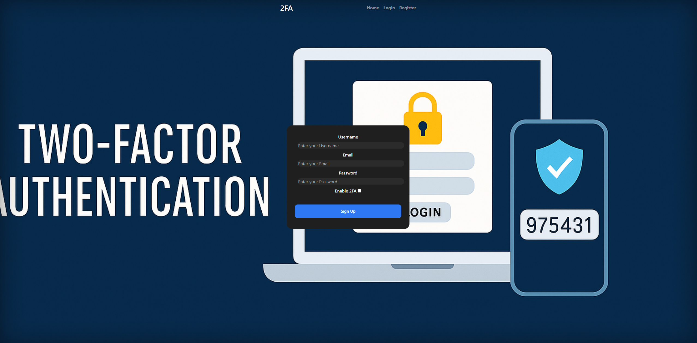
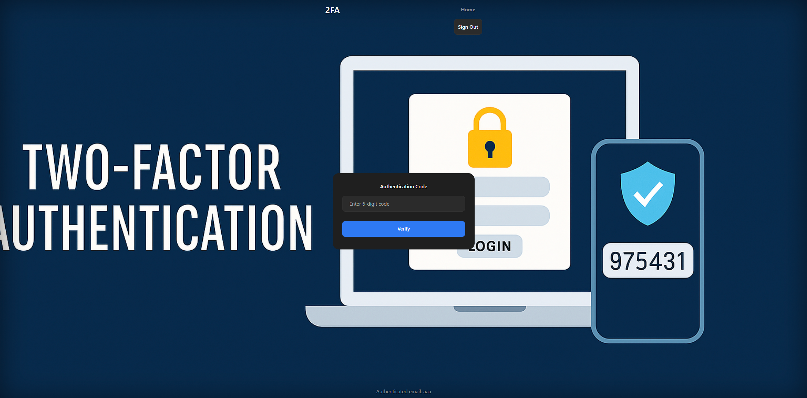

<div align="center">

<table>
  <tr>
    <td>
      
    </td>
    <td style="vertical-align: middle;">
      <h2 style="font-size: 0em; margin: 0;">Two Factor Authentication</h2>
    </td>
  </tr>
</table>

</div>

## Overview

2FASim is a Spring Boot web application demonstrating user authentication with optional Two-Factor Authentication (2FA) using Time-Based One-Time Passwords (TOTP). The 2FA implementation is compatible with popular authenticator apps like Google Authenticator.

### Key Features
- User registration with username, email, and password
- Optional 2FA enablement during registration
- Automatic generation of a TOTP secret and QR code for 2FA setup
- Secure login with username/password and, if enabled, TOTP code verification
- "Remember Me" functionality for user sessions
- Integration with PostgreSQL database
- Spring Security for authentication and authorization

---

## Getting Started

### Prerequisites

- Java 21+ installed
- PostgreSQL database running and accessible
- Maven or Gradle for building (optional if using pre-built jar)
- Internet access for QR code generation (uses QRServer API)

---

## Usage

### Registration
1. Create a new account by providing username, email and password  
2. Choose whether to enable 2FA during registration  
3. If 2FA is enabled:  
   - A secret will be automatically generated  
   - A QR code will be displayed which you can scan with an Authenticator app (e.g., Google Authenticator, Authy)  
4. Save the QR code or secret in a secure place  

### Login
1. Log in with your username and password  
2. If 2FA is enabled:  
   - You'll be prompted to enter the TOTP code generated by your Authenticator app  
   - Enter the current code to complete authentication  
3. You may select "Remember Me" to stay logged in for future visits  

### User Settings
After logging in, you can:  
1. View your account settings  
2. Enable/disable 2FA as needed  
3. Regenerate or disable your 2FA secret and QR code

---

## Screenshots

### Register:


### 2FA:


## Running the Application from JAR

1. **Update application properties**
```bash
spring.datasource.username=your_db_user
spring.datasource.password=your_db_password
spring.jpa.hibernate.ddl-auto=update

security.rememberme.key=YOUR_SECURITY_KEY
security.rememberme.token-validity=YOUR_SECURITY_TOKEN
```

2. **Build the JAR** (if you haven't yet):

```bash
cd /path/to/repo-folder
./mvnw clean package
java -jar target/2FASim-0.0.1-SNAPSHOT.jar
```
